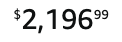
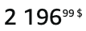
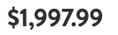
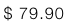

# Examples of prices in the different industries

| Application     | Currency        | Language | Format | Price         | Screenshot                                                                               |
| --------------- | --------------- | -------- | ------ | ------------- | ---------------------------------------------------------------------------------------- |
| Air Canada      | Canadian Dollar | English  | text   | $1753         |       |
| Air Canada      | Canadian Dollar | French   | text   | $1753         |       |
| Air Canada      | Euro            | English  | text   | €2677.35      |                  |
| Air Canada      | Euro            | French   | text   | €2677,35      |                  |
| Air Canada      | US Dollar       | English  | text   | US$1288       |             |
| AirBnb          | Canadian Dollar | English  | text   | $341 CAD      |           |
| AirBnb          | Euro            | French   | text   | 150€          |                      |
| AirBnb          | US Dollar       | English  | text   | $190          |                 |
| AirBnb          | US Dollar       | English  | text   | $799.90       |      |
| AirBnb          | Yen             | Japanese | text   | ￥ 33,077     |                       |
| Amazon          | Canadian Dollar | English  | style  | $2,196.99     |         |
| Amazon          | Canadian Dollar | English  | text   | $3,257.97     |           |
| Amazon          | Canadian Dollar | French   | style  | 2 196.99$     |         |
| Amazon          | Canadian Dollar | French   | text   | 3 257,97$     |           |
| Amazon          | Euro            | German   | style  | €1,444.15     |                    |
| Amazon          | Euro            | German   | text   | €1,463.14     |                      |
| Amazon          | Euro            | French   | text   | 5 287.14€     |                      |
| Amazon          | US Dollar       | English  | text   | $2,395.99     |                 |
| Amazon          | US Dollar       | Spanish  | text   | US$3,395.99   |                 |
| Amazon          | Yen             | Japanese | text   | ￥ 121,111    |                          |
| Apple           | Canadian Dollar | English  | text   | $69.00        |            |
| Apple           | Canadian Dollar | French   | text   | $69.00        |            |
| Apple           | Euro            | German   | text   | 59,00€        |                       |
| Apple           | Euro            | French   | text   | 59,00€        |                       |
| Apple           | US Dollar       | French   | text   | $49.00        |                  |
| Apple           | Yen             | Japanese | text   | ￥ 7,980      |                        |
| Booking.com     | Euro            | German   | text   | € 2.071       |                 |
| Booking.com     | Euro            | French   | text   | € 2.071       |                 |
| Booking.com     | US Dollar       | English  | text   | $1,038        |            |
| Booking.com     | US Dollar       | French   | text   | US$275        |            |
| British Airways | Canadian Dollar | English  | text   | CA$1,614      |  |
| British Airways | Canadian Dollar | French   | text   | 1614 $CA      |  |
| British Airways | US Dollar       | English  | text   | $471          |        |
| British Airways | US Dollar       | French   | text   | 471 $US       |        |
| Delta Airline   | US Dollar       | English  | style  | $1,013.98 USD |        |
| Delta Airline   | US Dollar       | English  | text   | $845.00       |          |
| Delta Airline   | US Dollar       | Spanish  | style  | $922.60 USD   |        |
| Delta Airline   | US Dollar       | Spanish  | text   | $760.00       |          |
| Delta Airline   | US Dollar       | French   | style  | $8,483.30 USD |        |
| Nike            | Canadian dollar | English  | text   | $150          |             |
| Nike            | Euro            | German   | text   | 139,99 €      |                        |
| Nike            | Euro            | French   | text   | 169,99 €      |                        |
| Nike            | Yen             | Japanese | text   | ￥ 18,700     |                         |
| Uber            | Canadian dollar | English  | text   | CA$90.76      |             |
| Uber            | Euro            | English  | text   | €20.23        |                        |
| Uber            | US Dollar       | English  | text   | $89.50        |                   |
| Walmart         | Canadian Dollar | English  | text   | $1,011.75     |          |
| Walmart         | Canadian Dollar | French   | text   | 1,011.75 $    |          |
| Walmart         | Us Dollar       | English  | text   | $1,997.99     |                |
| Zara            | Canadian Dollar | English  | text   | $ 79.90       |             |
| Zara            | Canadian Dollar | French   | text   | $ 79.90       |             |
| Zara            | Euro            | German   | text   | 49,95 EUR     |                        |
| Zara            | Euro            | French   | text   | 99,95 EUR     |                        |
| Zara            | Us Dollar       | English  | text   | $ 29.90       |                   |
| Zara            | Yen             | Japanese | text   | ￥ 8,590      |                         |
